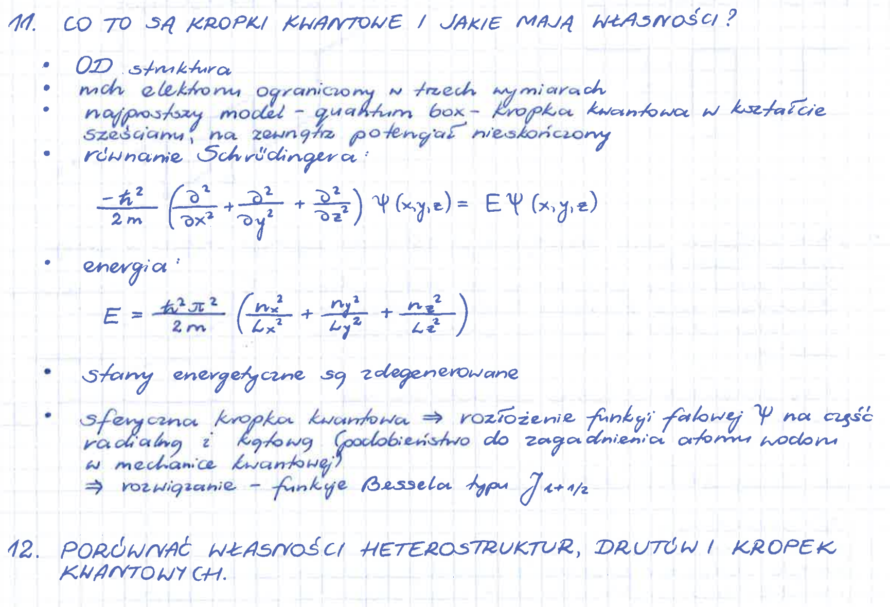

# Transkrypcja

Poniżej osadzony jest obrazek `zrzut.png` z odręcznymi notatkami.



## Prompt użyty do wygenerowania tekstu przez AI

```text
Przepisz możliwie wiernie odręczne polskie notatki z obrazu do Markdown.
Zachowaj nagłówki, listę punktowaną i wzory matematyczne. Wzory zapisz
w LaTeX-u zgodnym z renderowaniem GitHub Markdown. Nie dopowiadaj treści,
której nie widać. Po transkrypcji popraw oczywiste literówki i sprawdź zapis
symboli fizycznych.
```

## Finalna wersja notatki

### 11. Co to są kropki kwantowe i jakie mają własności?

- Struktura 0D.
- Elektrony są ograniczone w trzech wymiarach.
- Najprostszy model: *quantum box* — cząstka kwantowa w sześcianie, na zewnątrz potencjał nieskończony.
- Równanie Schrödingera:

$$
-\frac{\hbar^2}{2m}
\left(
\frac{\partial^2}{\partial x^2}
+\frac{\partial^2}{\partial y^2}
+\frac{\partial^2}{\partial z^2}
\right)
\Psi(x,y,z)
=
E\Psi(x,y,z).
$$

- Energia:

$$
E=
\frac{\hbar^2\pi^2}{2m}
\left(
\frac{n_x^2}{L_x^2}
+\frac{n_y^2}{L_y^2}
+\frac{n_z^2}{L_z^2}
\right).
$$

- Stany energetyczne są zdegenerowane.
- Sferyczna kropka kwantowa: rozłożenie funkcji falowej $\Psi$ na część radialną i kątową, podobnie jak w zagadnieniu atomu wodoru w mechanice kwantowej.
- Rozwiązanie części radialnej prowadzi do funkcji Bessela typu $J_{\ell+1/2}$.

### 12. Porównać własności heterostruktur, drutów i kropek kwantowych

Na dostarczonym zrzucie widoczny jest jedynie tytuł kolejnego punktu; dalszej treści nie ma w kadrze.
