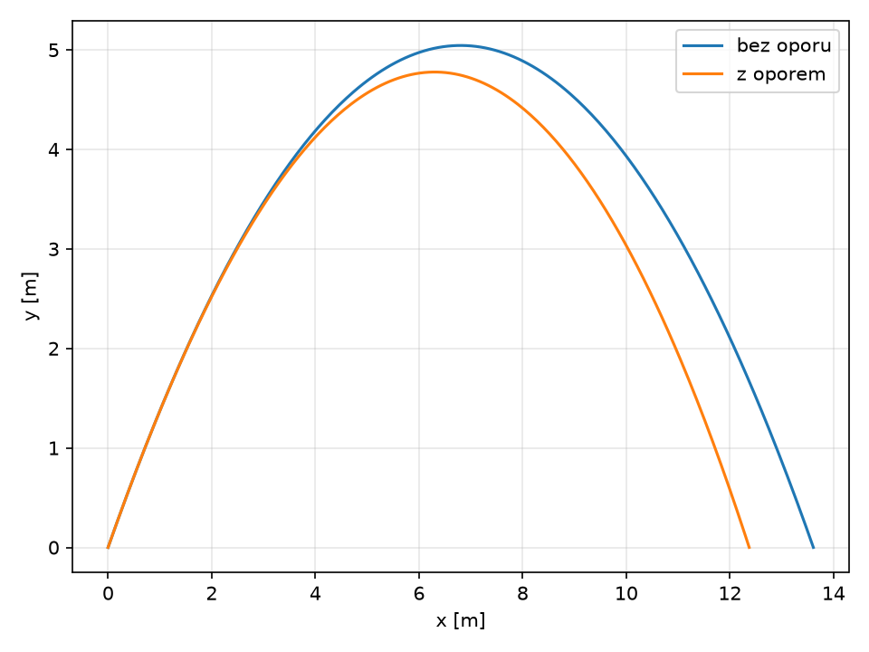
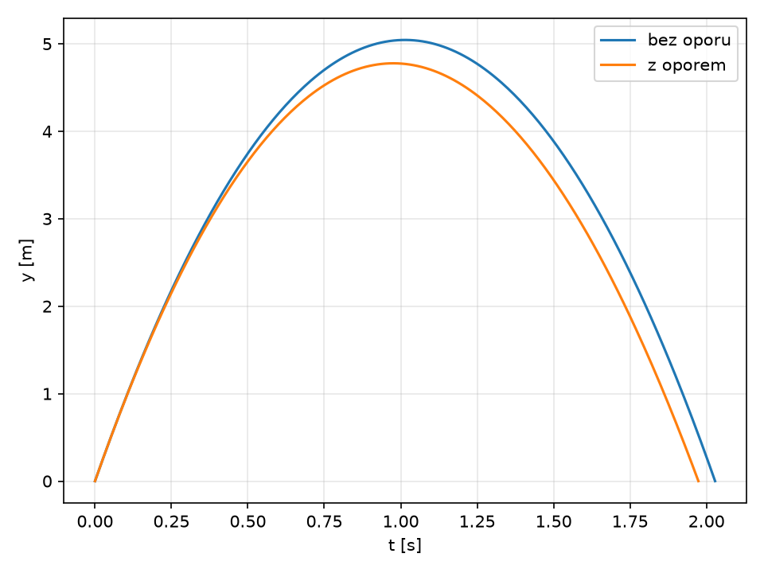
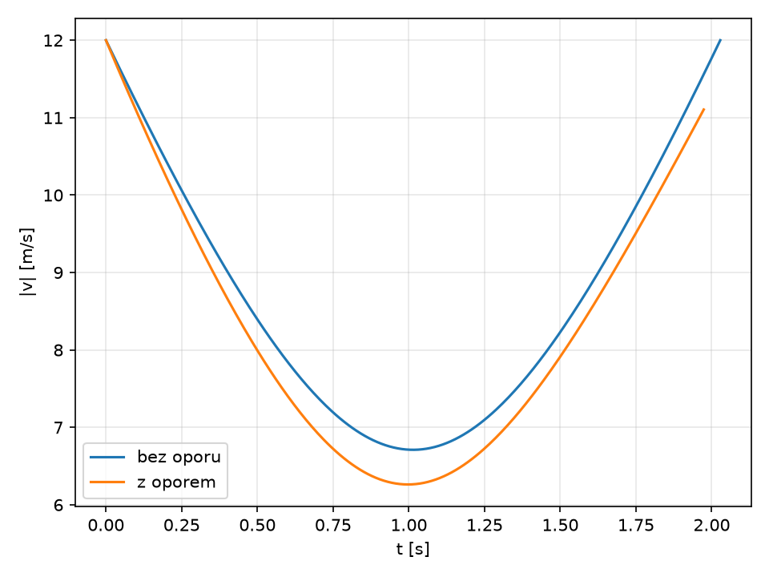
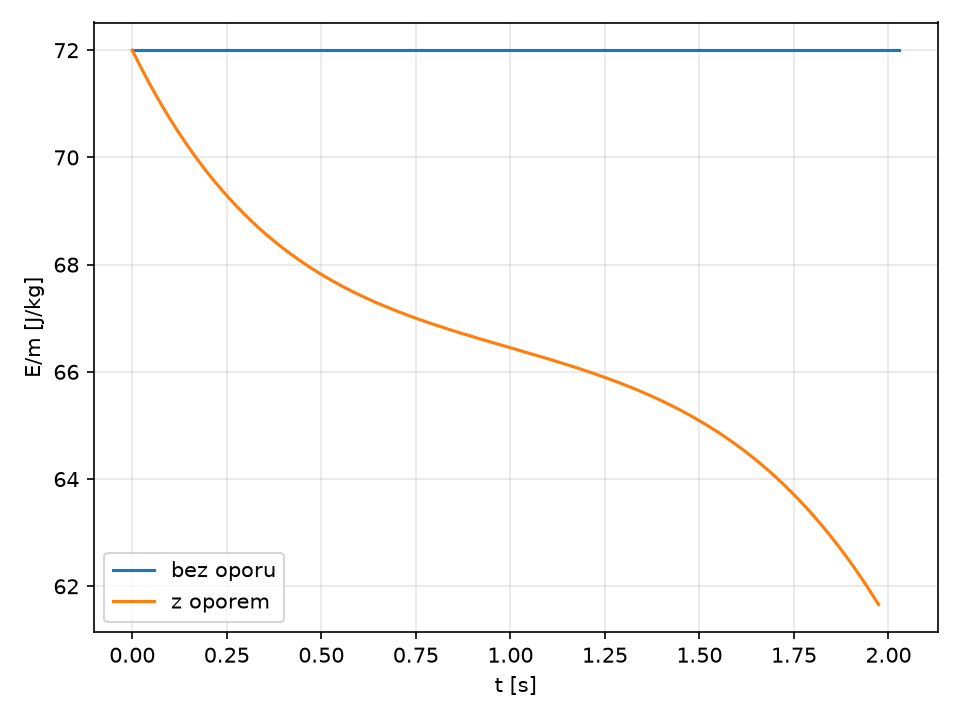

# Rzut ukośny bez i z oporem powietrza

> **Rozwiązanie wzorcowe prowadzącego.** Zadanie studenckie uzależnia parametry od numeru indeksu. W tej wersji przyjęto przykładowy indeks `123456`, więc $v_0=12\ \mathrm{m/s}$ oraz $\alpha=56^\circ$. Student powinien zastąpić te dwie wartości swoimi.

## 1. Założenia i dane

Pracujemy w układzie SI. Początek układu współrzędnych znajduje się w punkcie wyrzutu, oś $x$ jest pozioma, a oś $y$ pionowa. Przyjmujemy

- $v_0=12\ \mathrm{m/s}$,
- $\alpha=56^\circ$,
- $g=9.81\ \mathrm{m/s^2}$,
- masa $m=0.145\ \mathrm{kg}$.

Dla ruchu z oporem stosujemy model oporu kwadratowego

$$
\vec F_d=-\frac12\rho C_d A\,|\vec v|\vec v,
$$

gdzie $\rho=1.225\ \mathrm{kg/m^3}$, $C_d=0.47$ i $A=0.0042\ \mathrm{m^2}$.

## 2. Rzut ukośny bez oporu powietrza

Równanie ruchu ma postać

$$
m\ddot{\vec r}=m\vec g.
$$

Po rozłożeniu na składowe otrzymujemy

$$
\ddot x=0,
\qquad
\ddot y=-g.
$$

Warunki początkowe:

$$
x(0)=0,\quad y(0)=0,\quad
\dot x(0)=v_0\cos\alpha,\quad
\dot y(0)=v_0\sin\alpha.
$$

Po całkowaniu:

$$
x(t)=v_0\cos\alpha\,t,
$$

$$
y(t)=v_0\sin\alpha\,t-\frac12gt^2.
$$

Czas lotu jest równy

$$
t_f=\frac{2v_0\sin\alpha}g,
$$

a zasięg

$$
R=\frac{v_0^2\sin 2\alpha}g.
$$

Dla przyjętych danych otrzymujemy w przybliżeniu:

- czas lotu $t_f=2.028\ \mathrm{s}$,
- zasięg $R=13.610\ \mathrm{m}$,
- maksymalna wysokość $h_\max=5.044\ \mathrm{m}$.

## 3. Rzut ukośny z oporem kwadratowym

Po uwzględnieniu oporu:

$$
m\dot{\vec v}
=
m\vec g
-
\frac12\rho C_d A|\vec v|\vec v.
$$

Wprowadzając

$$
\beta=\frac{\rho C_d A}{2m},
$$

otrzymujemy układ równań

$$
\dot x=v_x,\qquad
\dot y=v_y,
$$

$$
\dot v_x=-\beta\sqrt{v_x^2+v_y^2}\,v_x,
$$

$$
\dot v_y=-g-\beta\sqrt{v_x^2+v_y^2}\,v_y.
$$

Ten układ nie ma równie prostego rozwiązania elementarnego jak przypadek próżniowy, dlatego rozwiązano go numerycznie metodą `solve_ivp` z biblioteki SciPy. Integrację zatrzymujemy przy ponownym osiągnięciu $y=0$.

Dla przyjętych parametrów otrzymujemy:

- czas lotu około $1.974\ \mathrm{s}$,
- zasięg około $12.372\ \mathrm{m}$,
- maksymalna wysokość około $4.777\ \mathrm{m}$.

## 4. Porównanie trajektorii



Opór powietrza skraca zasięg i obniża maksymalną wysokość. Trajektoria przestaje być idealną parabolą, ponieważ przyspieszenie zależy od aktualnej wartości i kierunku prędkości.

## 5. Wysokość w funkcji czasu



W próżni zależność $y(t)$ jest dokładnie kwadratowa. Przy oporze ruch w pionie jest asymetryczny: opór działa przeciwnie do prędkości zarówno podczas wznoszenia, jak i spadania.

## 6. Prędkość



Bez oporu składowa pozioma prędkości jest stała. Z oporem maleje również $v_x$, a wartość całkowitej prędkości traci symetrię względem wierzchołka toru.

## 7. Energia mechaniczna



Bez oporu energia mechaniczna

$$
E=\frac12mv^2+mgy
$$

jest stała. W modelu z oporem maleje, ponieważ siła oporu wykonuje pracę ujemną.

## 8. Kod użyty do obliczeń i wykresów

Kod znajduje się także w pliku `generuj_wykresy.py`.

```python
import math
import numpy as np
import matplotlib.pyplot as plt
from scipy.integrate import solve_ivp

# Rozwiązanie wzorcowe prowadzącego.
# Przykładowy indeks 123456 -> v0 = 12 m/s, alpha = 56 deg.
v0 = 12.0
alpha = math.radians(56.0)
g = 9.81

# Parametry dla modelu oporu kwadratowego
m = 0.145        # kg
rho = 1.225      # kg/m^3
Cd = 0.47
A = 0.0042       # m^2
beta = 0.5 * rho * Cd * A / m

def vacuum():
    tf = 2 * v0 * math.sin(alpha) / g
    t = np.linspace(0, tf, 300)
    x = v0 * math.cos(alpha) * t
    y = v0 * math.sin(alpha) * t - 0.5 * g * t**2
    vx = np.full_like(t, v0 * math.cos(alpha))
    vy = v0 * math.sin(alpha) - g * t
    return t, x, y, vx, vy

def rhs(t, s):
    x, y, vx, vy = s
    speed = math.hypot(vx, vy)
    return [
        vx,
        vy,
        -beta * speed * vx,
        -g - beta * speed * vy,
    ]

def ground(t, s):
    return s[1] if t > 1e-8 else 1.0

ground.terminal = True
ground.direction = -1

tv, xv, yv, vxv, vyv = vacuum()
sol = solve_ivp(
    rhs,
    [0, 10],
    [0, 0, v0*math.cos(alpha), v0*math.sin(alpha)],
    events=ground,
    dense_output=True,
    max_step=0.01,
    rtol=1e-9,
    atol=1e-11,
)
tf = sol.t_events[0][0]
td = np.linspace(0, tf, 300)
xd, yd, vxd, vyd = sol.sol(td)

# 1. Trajektoria
plt.figure()
plt.plot(xv, yv, label="bez oporu")
plt.plot(xd, yd, label="z oporem")
plt.xlabel("x [m]"); plt.ylabel("y [m]")
plt.legend(); plt.grid(alpha=0.3); plt.tight_layout()
plt.savefig("trajektoria.png", dpi=150)
plt.close()

# 2. Wysokość
plt.figure()
plt.plot(tv, yv, label="bez oporu")
plt.plot(td, yd, label="z oporem")
plt.xlabel("t [s]"); plt.ylabel("y [m]")
plt.legend(); plt.grid(alpha=0.3); plt.tight_layout()
plt.savefig("wysokosc_czas.png", dpi=150)
plt.close()

# 3. Prędkość
sv = np.hypot(vxv, vyv)
sd = np.hypot(vxd, vyd)
plt.figure()
plt.plot(tv, sv, label="bez oporu")
plt.plot(td, sd, label="z oporem")
plt.xlabel("t [s]"); plt.ylabel("|v| [m/s]")
plt.legend(); plt.grid(alpha=0.3); plt.tight_layout()
plt.savefig("predkosc_czas.png", dpi=150)
plt.close()

# 4. Energia na jednostkę masy
Ev = 0.5*sv**2 + g*yv
Ed = 0.5*sd**2 + g*yd
plt.figure()
plt.plot(tv, Ev, label="bez oporu")
plt.plot(td, Ed, label="z oporem")
plt.xlabel("t [s]"); plt.ylabel("E/m [J/kg]")
plt.legend(); plt.grid(alpha=0.3); plt.tight_layout()
plt.savefig("energia_czas.png", dpi=150)
plt.close()
```

## 9. Wnioski

Model bez oporu daje rozwiązanie analityczne i paraboliczny tor. Po wprowadzeniu oporu kwadratowego równania stają się nieliniowe i naturalnym narzędziem jest całkowanie numeryczne. Dla tych samych warunków początkowych opór powietrza zmniejsza zasięg, maksymalną wysokość i energię mechaniczną ciała.

Najważniejszy element zadania nie polega na samym wygenerowaniu wykresów, lecz na zachowaniu spójności między równaniami, parametrami w jednostkach SI, kodem i przedstawionymi wynikami.
